# Optics MCP Server

A Model Context Protocol (MCP) server for the Optics Design System, enabling LLMs to understand and work with design tokens, components, and documentation from https://docs.optics.rolemodel.design.

## ⚠️ IMPORTANT: Understanding Optics

**If you're an AI agent, read [SYSTEM_OVERVIEW.md](./SYSTEM_OVERVIEW.md) FIRST!**

Optics uses a sophisticated HSL-based color system that's different from typical design systems. The system overview explains:
- Why there's no `--color-primary` token (use `--op-color-primary-base` instead)
- The three-layer token architecture (HSL base → Scale → On tokens)
- How to find and use the correct tokens
- Common mistakes and how to avoid them

**Key insight:** Optics has 500+ color tokens organized as a predictable scale system, not simple name-value pairs.

## Overview

This MCP server provides **14 tools** and resources for working with the Optics design system:

- **83 Design Tokens**: Real HSL-based colors, calc-based spacing, typography, borders, and shadows
- **24 Components**: All Optics components with accurate token dependencies extracted from SCSS
- **7 Core Tools**: Query tokens, components, and documentation
- **7 Advanced Tools**: Theme generation, validation, accessibility checking, code scaffolding, and style guide generation
- **5 MCP Prompts**: Pre-configured workflows for common design system tasks
- **Documentation**: Design system guidelines and best practices

## Architecture

```mermaid
graph TB
    subgraph "MCP Client (AI/LLM)"
        CLIENT[AI Agent/LLM]
    end

    subgraph "Optics MCP Server"
        SERVER[MCP Server<br/>stdio transport]
        
        subgraph "Resources (13)"
            SYSTEM[optics://system-overview]
            DOC_INTRO[optics://documentation/introduction]
            DOC_START[optics://documentation/getting-started]
            DOC_TOKENS[optics://documentation/design-tokens]
            DOC_COLOR[optics://documentation/color-system]
            DOC_SPACING[optics://documentation/spacing]
            DOC_TYPO[optics://documentation/typography]
            DOC_COMP[optics://documentation/components]
            DOC_A11Y[optics://documentation/accessibility]
            TOK_ALL[optics://tokens/all]
            TOK_COLOR[optics://tokens/color]
            TOK_SPACING[optics://tokens/spacing]
            TOK_TYPO[optics://tokens/typography]
            COMP_ALL[optics://components/all]
        end
        
        subgraph "Core Tools (7)"
            T1[get_token]
            T2[search_tokens]
            T3[get_token_usage_stats]
            T4[get_component_info]
            T5[list_components]
            T6[get_component_tokens]
            T7[search_documentation]
        end
        
        subgraph "Advanced Tools (7)"
            T8[generate_theme]
            T9[validate_token_usage]
            T10[replace_hard_coded_values]
            T11[check_contrast]
            T12[suggest_token_migration]
            T13[generate_component_scaffold]
            T14[generate_sticker_sheet]
        end
        
        subgraph "Prompts (5)"
            P1[start-here]
            P2[get-token-reference]
            P3[component-guide]
            P4[theme-customization]
            P5[migration-guide]
        end
        
        subgraph "Data Layer"
            TOKENS[83 Design Tokens<br/>HSL colors, spacing,<br/>typography, borders, shadows]
            COMPONENTS[24 Components<br/>with token dependencies]
            DOCS[Documentation<br/>Guidelines & best practices]
        end
    end
    
    CLIENT -->|JSON-RPC| SERVER
    SERVER --> SYSTEM
    SERVER --> DOC_INTRO
    SERVER --> DOC_START
    SERVER --> DOC_TOKENS
    SERVER --> DOC_COLOR
    SERVER --> DOC_SPACING
    SERVER --> DOC_TYPO
    SERVER --> DOC_COMP
    SERVER --> DOC_A11Y
    SERVER --> TOK_ALL
    SERVER --> TOK_COLOR
    SERVER --> TOK_SPACING
    SERVER --> TOK_TYPO
    SERVER --> COMP_ALL
    SERVER --> T1
    SERVER --> T2
    SERVER --> T3
    SERVER --> T4
    SERVER --> T5
    SERVER --> T6
    SERVER --> T7
    SERVER --> T8
    SERVER --> T9
    SERVER --> T10
    SERVER --> T11
    SERVER --> T12
    SERVER --> T13
    SERVER --> T14
    SERVER --> P1
    SERVER --> P2
    SERVER --> P3
    SERVER --> P4
    SERVER --> P5
    T1 --> TOKENS
    T2 --> TOKENS
    T3 --> TOKENS
    T4 --> COMPONENTS
    T5 --> COMPONENTS
    T6 --> COMPONENTS
    T7 --> DOCS
    T8 --> TOKENS
    T9 --> TOKENS
    T10 --> TOKENS
    T11 --> TOKENS
    T12 --> TOKENS
    T13 --> COMPONENTS
    T14 --> TOKENS
    T14 --> COMPONENTS
    P1 --> SYSTEM
    P2 --> TOKENS
    P3 --> COMPONENTS
    P4 --> T8
    P5 --> T12
```



## Installation

### VS Code (Recommended) 🎨

Install directly from the [MCP Registry](https://registry.modelcontextprotocol.io/):

1. Open VS Code
2. Open the **MCP Servers** panel (Extensions icon in sidebar)
3. Search for **"optics"** or **"io.github.RoleModel/optics-mcp"**
4. Click **Install**

The server will be automatically configured and ready to use with AI assistants in VS Code.

### Quick Start (Zero-Install) ⚡

The easiest way to use Optics MCP - no installation required!

#### Claude Desktop

Add to your MCP configuration:

```json
{
  "mcpServers": {
    "optics": {
      "command": "npx",
      "args": ["-y", "optics-mcp"]
    }
  }
}
```

#### Claude Code CLI

Add with a single command:

```bash
claude mcp add optics -- npx -y optics-mcp
```

**Other useful commands:**

```bash
# List all MCP servers
claude mcp list

# Remove the Optics server
claude mcp remove optics

# View server details
claude mcp get optics

# Test the connection
claude mcp test optics
```

**That's it!** The server runs automatically whenever your MCP client needs it.

### Local Installation (For Development)

If you want to modify the server or contribute:

```bash
git clone https://github.com/RoleModel/optics-mcp.git
cd optics-mcp
npm install
npm run build
```

Then configure with the local path:

```json
{
  "mcpServers": {
    "optics": {
      "command": "node",
      "args": ["/absolute/path/to/optics-mcp/dist/index.js"]
    }
  }
}
```

## Usage

### Running Directly

```bash
npm start
```

## Available Tools (14 Total)

For detailed documentation of all tools, see [TOOLS.md](./TOOLS.md).

### Core Tools

#### `get_token`
Get detailed information about a specific design token.

#### `search_tokens`
Search for design tokens by category or name pattern.

#### `get_token_usage_stats`
Get statistics about design token usage across the system.

#### `get_component_info`
Get detailed information about a component including its design token dependencies.

#### `list_components`
List all available components in the design system.

#### `get_component_tokens`
Get all design tokens used by a specific component.

#### `search_documentation`
Search through Optics documentation.

### Advanced Tools

#### `generate_theme`
Create a custom branded theme with CSS variables and Figma Variables JSON.
- Outputs HSL-based theme overrides
- Generates Figma Variables format
- Creates theme preview

#### `validate_token_usage`
Find hard-coded values in code that should use design tokens.
- Detects colors, spacing, fonts, borders, shadows
- Suggests token replacements
- Validates token usage

#### `replace_hard_coded_values`
Automatically replace hard-coded values with design tokens.
- Manual mode: suggestions only
- Autofix mode: applies replacements
- Preserves code structure

#### `check_contrast`
Check WCAG color contrast ratios between tokens.
- Supports AA and AAA levels
- Works with token names or hex colors
- Provides accessibility recommendations

#### `suggest_token_migration`
Suggest tokens for legacy code migration.
- Maps old values to new tokens
- Prioritizes semantic tokens
- Provides rationale

#### `generate_component_scaffold`
Generate component code with Optics tokens.
- React, Vue, Svelte, HTML support
- Pre-configured with design tokens
- TypeScript types included

#### `generate_sticker_sheet`
**Generate a visual style guide** showing all design tokens and components.
- Complete color palettes with swatches
- Typography scale examples
- Spacing visualizations
- Component examples
- Multi-framework support (React, Vue, Svelte, HTML)
- Production-ready code output

## Available Resources

The server exposes the following resources via the `optics://` URI scheme:

### Documentation
- `optics://documentation/introduction` - Overview of Optics
- `optics://documentation/getting-started` - Getting started guide
- `optics://documentation/design-tokens` - Design token documentation
- `optics://documentation/color-system` - Color system guide
- `optics://documentation/spacing` - Spacing system guide
- `optics://documentation/typography` - Typography guide
- `optics://documentation/components` - Component library overview
- `optics://documentation/accessibility` - Accessibility guidelines

### Tokens
- `optics://tokens/all` - All design tokens
- `optics://tokens/color` - Color tokens only
- `optics://tokens/spacing` - Spacing tokens only
- `optics://tokens/typography` - Typography tokens only

### Components
- `optics://components/all` - All components

## Design System Overview

### Design Token Categories

1. **Colors** (25 tokens): HSL-based color system with primary, neutral, and alert colors
2. **Spacing** (11 tokens): calc-based rem units with base-10 scale (2px to 80px)
3. **Typography** (32 tokens): Noto Sans/Serif fonts with sizes, weights, and line heights
4. **Borders** (10 tokens): Border radius (small to pill) and widths
5. **Shadows** (5 tokens): Elevation system (x-small to x-large)

### Components (24 Total)

All components extracted from real Optics SCSS with accurate token dependencies:

- **Accordion**: Collapsible content panel
- **Alert**: Notification messages (warning, danger, info, notice)
- **Avatar**: User profile pictures
- **Badge**: Status indicators and labels
- **Breadcrumbs**: Navigation hierarchy
- **Button**: Interactive buttons with variants
- **ButtonGroup**: Grouped button container
- **Card**: Content containers with elevation
- **ConfirmDialog**: Action confirmation modals
- **Divider**: Content separators
- **Form**: Input fields, textareas, selects
- **Icon**: Material Symbols icons
- **Modal**: Overlay dialogs
- **Navbar**: Top navigation
- **Pagination**: Page navigation
- **SidePanel**: Sliding side panels
- **Sidebar**: Side navigation
- **Spinner**: Loading indicators
- **Switch**: Toggle switches
- **Tab**: Tabbed interfaces
- **Table**: Data tables
- **Tag**: Categorization labels
- **TextPair**: Label-value pairs
- **Tooltip**: Contextual information

Each component specifies which Optics design tokens it uses, making it easy to understand dependencies and maintain consistency.

## Development

### Build
```bash
npm run build
```

### Watch Mode
```bash
npm run watch
```

### Project Structure
```
optics-mcp/
├── src/
│   ├── index.ts          # MCP server implementation
│   └── optics-data.ts    # Design tokens and component data
├── dist/                 # Compiled JavaScript
├── package.json
├── tsconfig.json
└── README.md
```

## Token Usage Tracking

The server tracks which design tokens are used by each component, enabling:
- **Dependency Analysis**: Understand which tokens a component relies on
- **Impact Analysis**: See which components are affected by token changes
- **Usage Statistics**: Get insights into token usage patterns

## Contributing

To add new design tokens or components:

1. Edit `src/optics-data.ts`
2. Add tokens to the `designTokens` array
3. Add components to the `components` array, specifying their token dependencies
4. Rebuild the project: `npm run build`

## License

MIT

## Links

- [Optics Design System Documentation](https://docs.optics.rolemodel.design)
- [Model Context Protocol](https://modelcontextprotocol.io)
- [MCP TypeScript SDK](https://github.com/modelcontextprotocol/typescript-sdk)
